# Park That Thought

**A tiny floating cloud for Windows that catches stray thoughts while you work, so you can stay focused.**

You're in the middle of something and a thought pops up: "look this up", "reply to Sam", "did I pay that bill?". Instead of switching apps (and losing 20 minutes), you park it in two seconds and keep going. At your next break, every thought gets one of three exits: done, later, or let go.

**Capture now, decide at the break.**

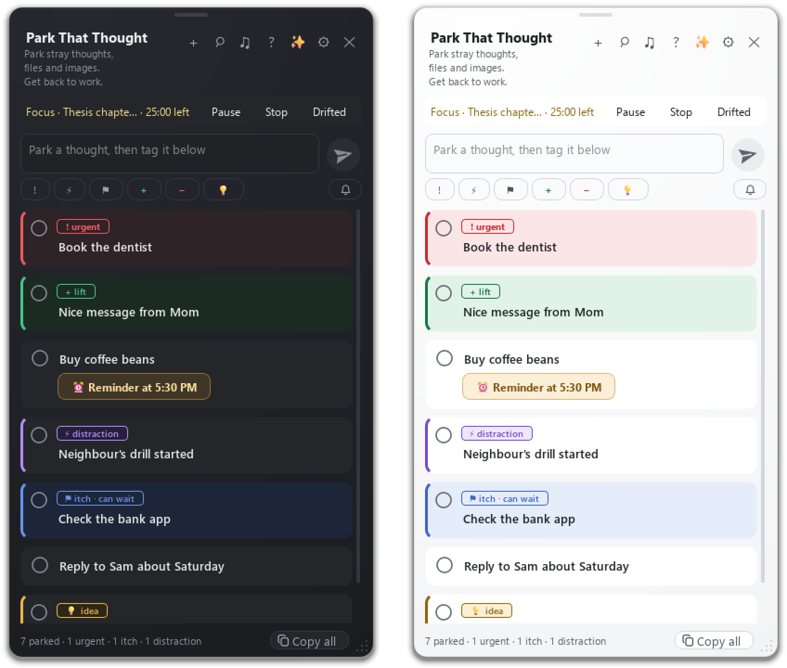

## Who it's for

- **People with ADHD or time blindness** who lose focus to their own thoughts, and lose track of time once they follow one.
- **Anyone who works in focus sessions** (Pomodoro or similar): students, researchers, programmers, writers.
- **People who want privacy on screen.** The cloud only shows a number, the quick note box never shows your other notes, and the app is hidden from screen shares and screenshots. Safe in a meeting, on a call or next to your boss.

It is not a full task manager. There's no account, no cloud sync and no phone app. It's one small Windows app that keeps everything on your PC.

## Install (about 2 minutes)

Open **Command Prompt** or **PowerShell** (press Start, type `cmd`, press Enter), paste this line and press Enter:

```
powershell -c "irm https://raw.githubusercontent.com/gmiqbal/ParkThatThought/main/install.ps1 | iex"
```

That's it. A cloud appears on the right edge of your screen.

What the installer does (you can [read it here](install.ps1), it's short):

1. Finds Python 3.9 or newer. If you don't have it, installs Python 3.12 with winget (Windows' own app installer).
2. Puts the app in `%LOCALAPPDATA%\ParkThatThought` with its own private Python environment, and installs its two libraries, PySide6 and pynput (about 200 MB the first time).
3. Adds **Park That Thought** to the Start menu and to startup, so it's there every time you log in.
4. Starts the app.

No admin rights needed. Running the same line again updates the app and never touches your notes.

## A quick tour

### Park a thought in two seconds

Press `Ctrl+Alt+P` (or scribble the mouse up and down over the cloud), type, press `Enter`. Your cursor goes straight back to where you were typing. The box never shows your other notes.

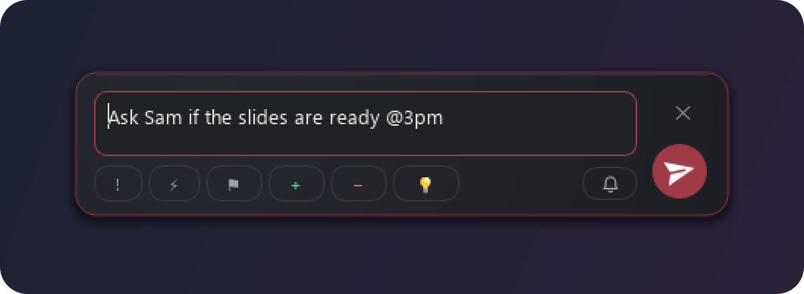

Tag it if you like: **urgent**, **distraction** (from outside), **itch** (feels urgent, can wait), **lift**, **drain** or **idea**. You can make your own flags too.

### The list

Click the cloud, press `Ctrl+Alt+L`, or scribble left and right over it. Each thought gets **Done**, **Later** or **Let go**, and `Ctrl+Z` undoes anything. Drag a file, image or link onto the cloud to park it, and drag it back out later. Nothing is ever hard deleted.

### Your calendar, floating on the taskbar

Connect Google Calendar (Settings > Calendar, with a private calendar link) and a small bar shows the current or next meeting with a countdown. It sits on the taskbar, or drag it anywhere to float. Click it for a three-day view with your events in their own colors. **+** opens a new event in Google Calendar, **Meet** starts a Google Meet.

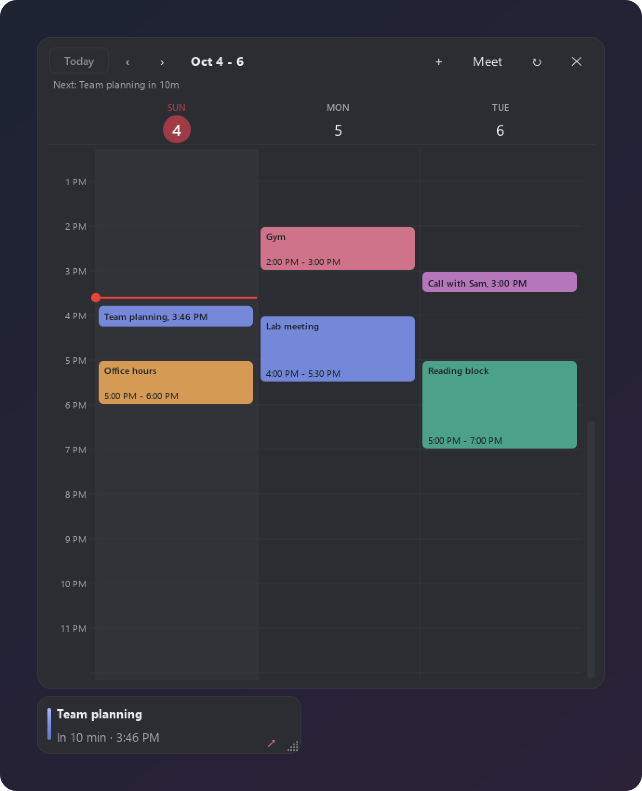

A few minutes before a meeting, a heads-up card glides out with **Join** when there's a call link. You pick the times (30, 10 and 5 minutes before, by default).

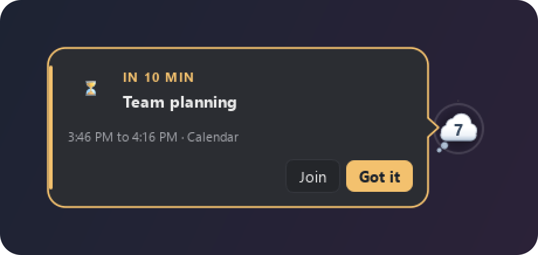

Your notes are never sent to Google.

### Focus rounds

Press **Focus** in the list. The cloud shows the countdown on its outline and asks what the round is for: the meeting coming up, your recent answers, or your own. Link focus and break, and the break starts by itself. While it runs: **Pause**, **Stop**, and **Drifted** to take out minutes you drifted off.

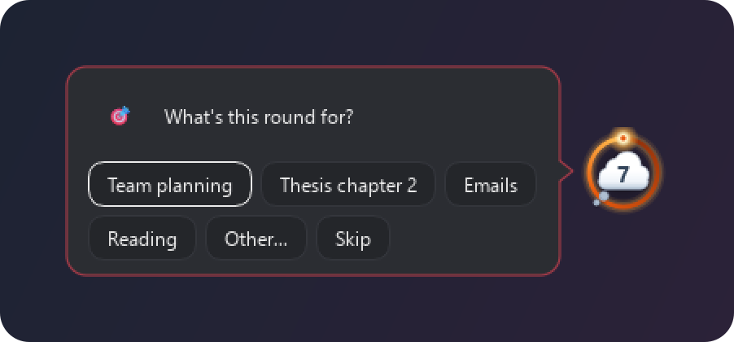

At the end, a card shows what you did. With app tracking on, it lists the apps you used, and you mark the ones that distracted you this round. **Take out** removes those minutes. Then pick a break or another round.

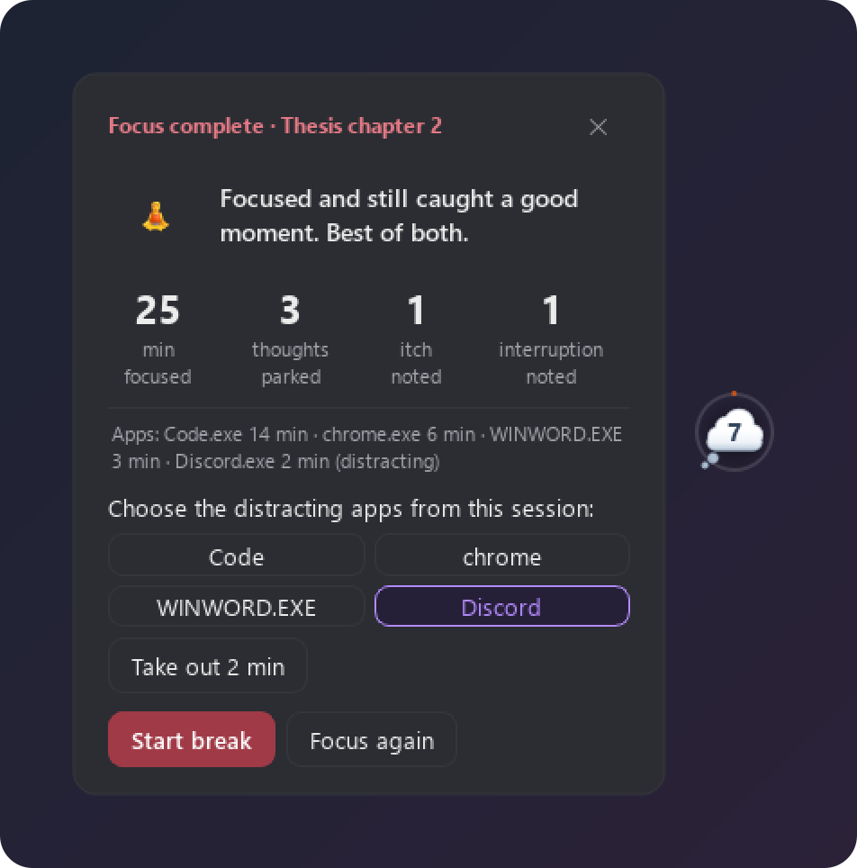

### Check-ins

After a long stretch at the computer without a focus round (every 45 minutes by default), the cloud asks a short question: start a focus round, take a break, log a round you forgot to time, or tell it you're on track. With Calendar connected it can mention what's coming up. Number keys answer it.

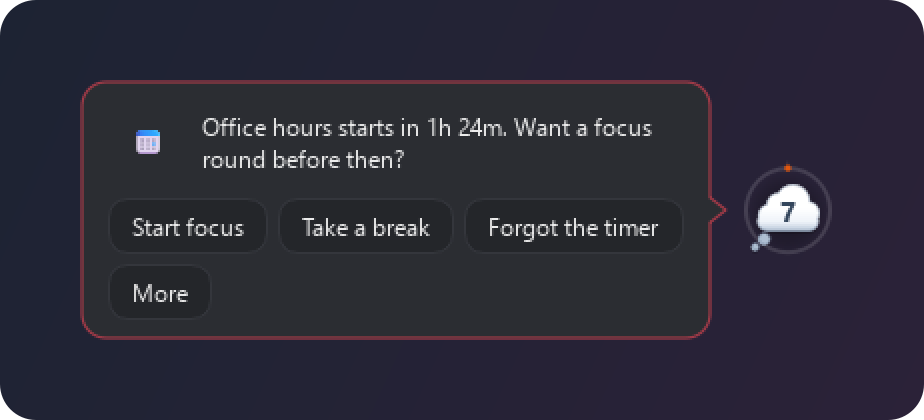

It stays quiet during calls (mic or camera in use), full screen and presentations. Pause it for an hour, the rest of the day, or until you turn it back on.

### Water and eye breaks

During focus, a tiny character peeks out from behind the cloud: a sip of water every 40 minutes, a look into the distance every 20. It ducks back after a few seconds and clicks pass through it. Optional: a soft sound first, and a 20 second look-away countdown.

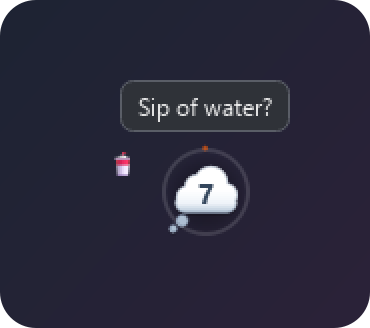

### Reminders

Add `20m`, `in 1 hour` or `at 3:30 pm` to any note, or press the bell. When it's due, a card grows out of the cloud with snooze buttons, **Open note** and **Done**. Reminders can repeat: every day, weekdays, every week, chosen days or every month.

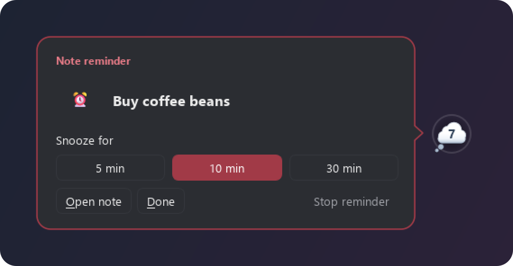

### Background noise and music

The **♫** button plays brown, pink or white noise made by the app (no sound files), at three volumes, or only during focus. Under **Music**, open the music folder, drop in your own songs (mp3, m4a, wav, flac, ogg and more), and pick one to play on repeat.

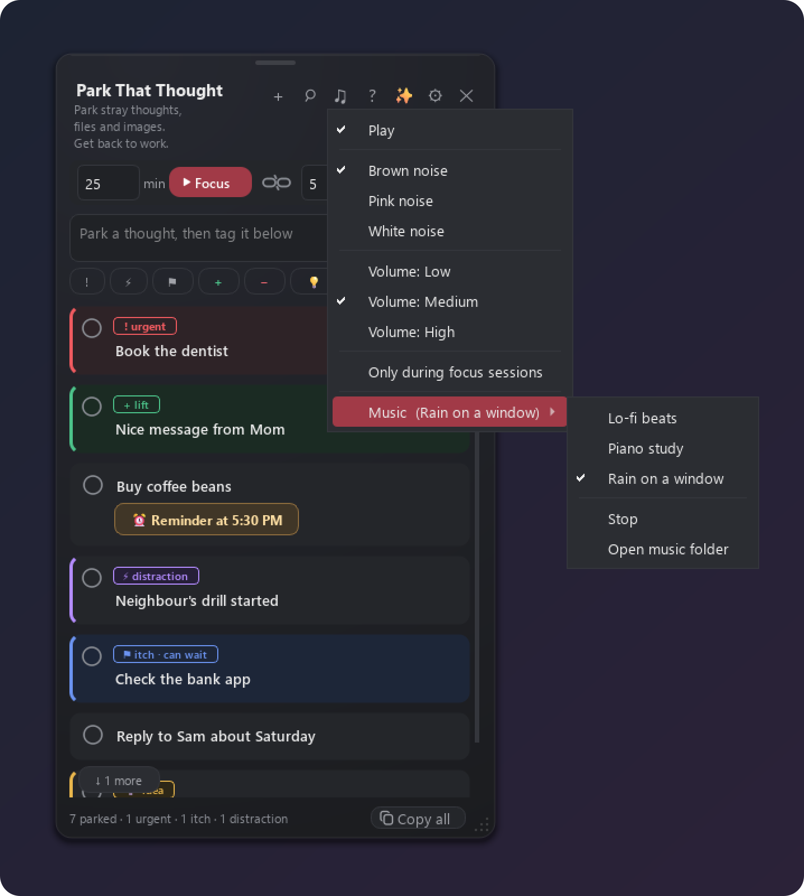

### Copy your patterns for AI

Every thought you park is logged on your PC: when it came, what the timer was doing, and what you did with it. The **✨** button copies the last 7 days, 30 days or everything as a ready-made prompt for any AI chat: what pulls you away, when, where your focus time goes, and one or two small experiments to try. Paste the answer back in to keep it.

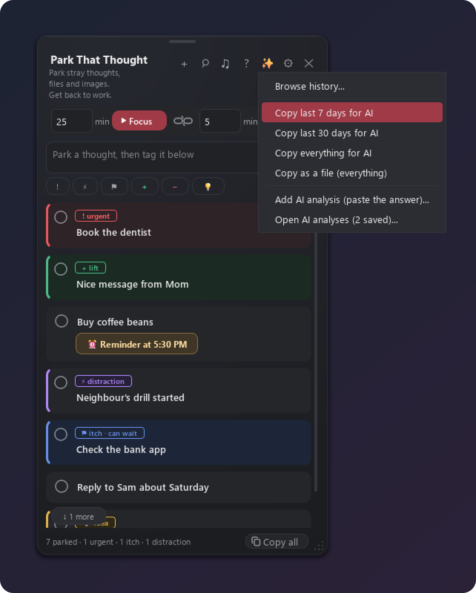

**Browse history** searches every thought you ever parked, by date, type and outcome.

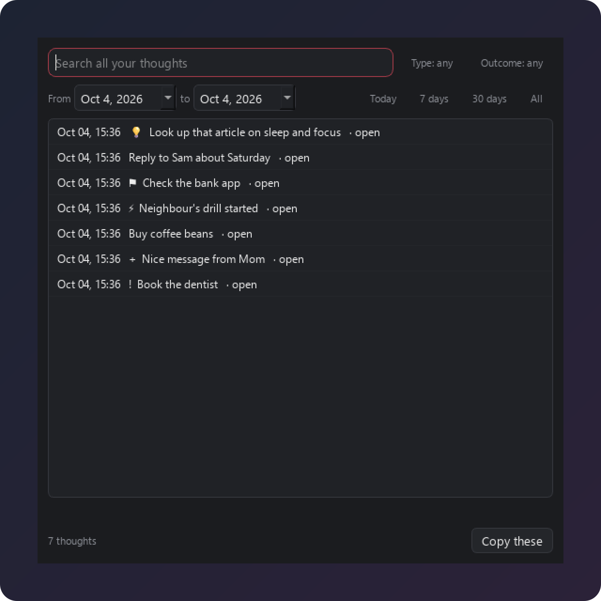

### Make it yours

System, Light or Dark theme (System follows Windows). Pick the cloud's color, shape (thought cloud, circle, squircle and more) and size. Settings also covers hotkeys, gestures, flags, opacity, check-ins, sounds and privacy.

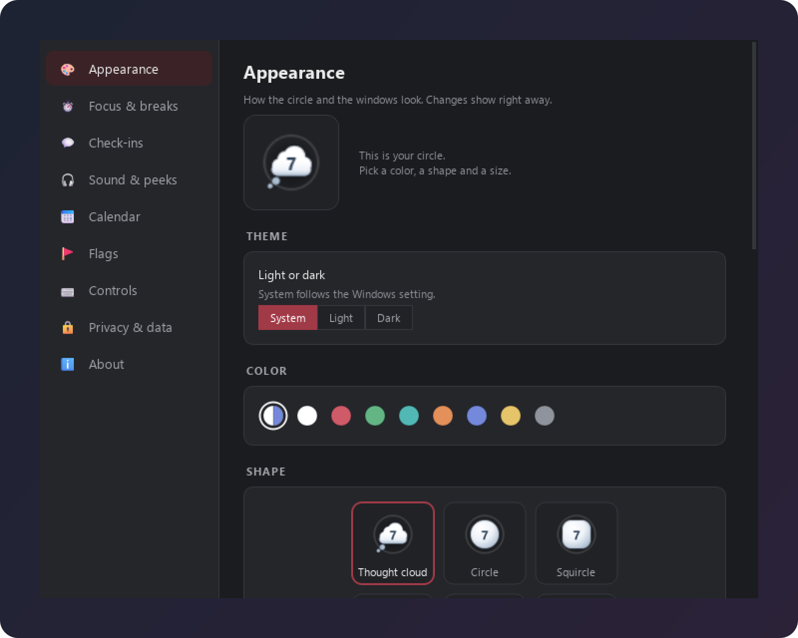

## Keys and clicks

| To | Do this |
|---|---|
| Park a thought | `Ctrl+Alt+P`, type, `Enter`. Or scribble the mouse up and down over the cloud. |
| See your list | Click the cloud, `Ctrl+Alt+L`, or scribble left and right over the cloud. |
| Deal with a thought | **Done**, **Later** or **Let go**. Undo with `Ctrl+Z`. |
| Start a focus round | **Focus** in the list. |
| Park a file, image or link | Drag it onto the cloud. |
| Get help | **?** in the list: how it works and a 1 minute tour. |
| Settings, timer, nap, quit | Right-click the cloud. |

Everything works from the keyboard.

## Privacy

- **Your notes stay on your PC**, in `%LOCALAPPDATA%\ParkThatThought\parking_lot_data`. No account, no server, no tracking.
- **Hidden from screen share and screenshots** by default (Zoom, Teams, Meet, OBS, Snipping Tool). You can turn this off.
- **App tracking during focus rounds** (on by default, turn it off in Settings > Focus & breaks) notes which app is in front so the end-of-round card can ask which ones distracted you. It never leaves your PC.
- **The internet is used only when you ask for it:** installing, **Restart / update**, and, if you turn them on, Google Calendar and phone alerts through ntfy.sh (timer messages only, never your notes).
- **Copy for AI** only copies text to your clipboard. You decide where to paste it.

## Updating

Right-click the cloud > **Restart / update**. It downloads the newest version from this page and restarts. Your notes stay as they are, and the previous version is kept as `parking_lot.py.bak`.

Or run the install line again.

## Uninstall

1. Right-click the cloud > **Quit**.
2. Press `Win+R`, type `shell:startup`, press Enter, and delete **Park That Thought**. Do the same with `shell:programs`.
3. Press `Win+R`, type `%LOCALAPPDATA%\ParkThatThought`, press Enter. Your notes are in `parking_lot_data`; copy that folder somewhere if you want to keep them. Then delete the `ParkThatThought` folder.

Only want it to stop starting with Windows? Do step 2 for `shell:startup` only.

## Questions

**Is it free?** Yes. MIT license.

**Mac or Linux?** Not supported yet. The core runs from source there, but screen-share hiding, focus handling and the quiet rules for check-ins are Windows only.

**Nothing appears after installing.** Look in `%LOCALAPPDATA%\ParkThatThought\parking_lot_data\error.log`. To see errors live, run this in Command Prompt:

```
"%LOCALAPPDATA%\ParkThatThought\venv\Scripts\python.exe" "%LOCALAPPDATA%\ParkThatThought\parking_lot.py"
```

**A hotkey doesn't work.** Another app may use it. Right-click the cloud > Settings > Controls, and pick another.

**Emoji look black and white.** Update the library: `"%LOCALAPPDATA%\ParkThatThought\venv\Scripts\python.exe" -m pip install -U PySide6`.

**Why the name?** "Park that thought" means "hold that thought, we'll come back to it". That's the whole app.

## Run from source

For developers, or Mac and Linux:

```
git clone https://github.com/gmiqbal/ParkThatThought
cd ParkThatThought
pip install -r requirements.txt
python parking_lot.py
```

In a git checkout, **Restart / update** only restarts. Use `git pull` to update. Notes are saved in `parking_lot_data/` next to the script.

The whole app is one file, `parking_lot.py`, with two libraries: PySide6 (Qt) and pynput (global hotkeys and mouse gestures).

## License

MIT. Made by G M Iqbal Mahmud.
